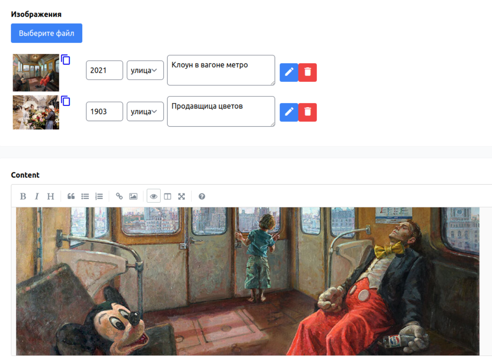

# Laravel Imageable
Any model can have images. For example, an Article, a Product, or a User. 
The `Imageable` package allows you quickly and easily to enable image uploading for any model.



## Preliminary remarks

### What does it mean - quickly and easily?
It is usually necessary to define a field in the table if you intend to upload one image
for one instance of the model, or a table if several images can be uploaded.
In addition, it is necessary to provide for the processing of uploaded files, their saving and deletion.

The `Imageable` package makes this process easier. Adding the necessary functionality becomes
much easier. Uploading files, processing them, and saving them to the desired storage is taken over by `Imageable`.

A single table is used to store information about all uploaded files. You can understand
which model a particular file belongs to by the value of two fields:
`imageable_type` - it stores the name of the model and `imageable_id` is the `ID` of the model of type `imageable_type`.
Thus, both one and many uploaded files can be associated with a specific instance of the model.

### API
The `Imageable` package uses the `API` to download, process and save files. Therefore,
authentication is required for the package to work. By default, `basic` stateless authentication is used to pass tests and make to a quick start.

The parameter required for authentication is defined in the application configuration `config/app.php `.
```
    'credentials' => [
        'basic' => ('Basic ' . env('APP_BASIC')),
    ],
```

### Changes
`Tailwindcss` is used in `Laravel` by default, as in the `Imageable` package.
Since `css`, `js`, `views` resources are published after installing the package, it is possible to change templates and
customize interface elements.

## Installation
Either run
```
composer require sergmoro1/laravel-imageable
```

or add to the `require` section of your `composer.json`.
```
"sergmoro1/laravel-imageable": "^1.0"
```

## Run migration
```
php artisan migrate
```

## Publish views
```
php artisan vendor:publish --provider="Sergmoro1\Imageable\ImageableServiceProvider"
```

## Usage
For ability images uploading add `HasStorage`, `HasImages` traits to the model.
```
use Illuminate\Database\Eloquent\Factories\HasFactory;
use Illuminate\Database\Eloquent\Model;
use Sergmoro1\Imageable\Traits\HasStorage;
use Sergmoro1\Imageable\Traits\HasImages;

class Post extends Model
{
    use HasFactory, HasStorage, HasImages;
```
Insert upload component in a view.
```
<x-imageable-upload :model="$post"/>
```
Please note that the component uses an instance of the model, therefore, it must be available in the template.

In the same or more appropriate blade-template, you need to insert the registration of download options.
```
    <x-slot name="scripts">
      <script>var upload Options = <?= $post->upload Options() ?>;</script>
    </x-slot>
```
For example, for the `Post` model, the component `<x-imageable-upload :model="$post"/>` is inserted in the view
`views/post/form.blade.php `, registration of options can also be performed there.

If the necessary `css` and `js` files are already connected to the page, and this is possible if you have already connected `Imageable` for another model, then you can upload images.

If not yet, read on)

## CSS
In a file `resources/css/app.css`, after lines
```
@tailwind base;
@tailwind components;
@tailwind utilities;
```
add line
```
@import "./imageable/upload.css";
```
Obviously, you can make adjustments to the definition of classes in the file `resources/css/imageable.upload.css`.

## JS
The `jQuery` plugin [`simpleUpload`](http://simpleupload.michaelcbrook.com/) is used to upload images, so you need to add `jQuery` library in the file `resources/js/app.js`.
```
window.$ = window.jQuery = require('jquery');
```

Then should be loaded the plugin and thier handler.
```
require('jquery-simple-upload/simpleUpload');
require('./simpleUpload.js');
```

It is assumed that you can upload more than one file for a specific model, so you can add a plugin for sorting of images [`Sortable`](https://github.com/SortableJS/Sortable). This is important when you want to change the order of image output in frontend or want to use the first image as the main image. Sorting is performed by drag & drop the mouse.
```
import Sortable from 'sortablejs';
el = document.querySelector('ul.table');
if (el) {
  var sortable = Sortable.create(el, {
    onEnd: function (evt) {
      axios.put('/api/images/' + evt.item.id, {
        oldIndex: evt.oldIndex,
        newIndex: evt.newIndex,
      })
      .then(response => {
        console.log(response);
      })
      .catch(err => {
        console.log(err);
      });
    },    
  });
}
```
Of course, the plugins used must be pre-installed.

## CSS placement
The `Imageable` package uses `Google Material Icons`, so you need to connect the icons to the page.
For example in `views/layouts/app.blade.php `.

```
  <link href="https://fonts.googleapis.com/icon?family=Material+Icons" rel="stylesheet">
  <link href="{{ url('css/app.css') }}" rel="stylesheet">
```

## JS placement
Since the `Imageable` package uses the `API` to upload files, authentication is required.
By default, the package uses `basic` stateless authentication to run tests and quickly start using the package.
Place the credentials on the page, for example in `views/layouts/app.blade.php `.

```
  <script>var app_credentials = '<?= config('app.credentials.basic'); ?>';</script>
  {{ $scripts }}
  <script src="/js/app.js"></script>
```

## Finally
Run in the project directory:
```
npm run dev
```

## Configure model
By default, the parameters for storing images are set.
```
'disk' => 'public',
'path' => '',
'seperatly' => true,
```
An empty `path` parameter means that a subdirectory with the model name will be created on the selected disk. For example, `storage/app/public/post`. The `separately` parameter set to `true` means that a separate directory will be created for each model with the `Id` of the model as the name. For example, `storage/app/public/post/1`.
Storage parameters can be changed according to the principles of Laravel file storage using the `setStorage` method of the `Sergmoro1\Imageable\Traits\HasStorage` class.

Only the `caption` field is set as an additional field for each image. The list of fields, their order and default values can also be redefined using the `setAddonDefaults()` method of the class `Sergmoro1\Imageable\Traits\HasImages`.

Both methods must be called in the constructor of the corresponding model. For example, defining fields:
```
class Post extends Model
{
    use HasFactory, HasStorage, HasImages;
    
    public function __construct(array $attributes = []) {
        parent::__construct($attributes);
        $this->setAddonsDefaults([
            'year' => '',
            'category' => 'home',
            'caption' => '',
        ]);
    }
```

## Configure views
After installing the package, the component files are copied to the `resources\views\vendor\imageable` directory, where you can freely edit html markup, change styles and add/remove fields to describe each uploaded image.

The component for loading images can be inserted anywhere in the view. Not necessarily inside the `form` tag.

```
<x-imageable-upload :model="$post"/>
```

## Configure fields view
To change the list of additional fields of uploaded images, you need to edit the default values in the `addonDefaults` variable of the model, as mentioned above, and the `vendor\imageable\line\fields.blade.php` view, where it is necessary to define additional html markup. An example with possible fields and their values is given in the package in the file `fiealds-example.blade.php`.

If the list of additional fields varies from model to model, then the contents of the files `line\fields.blade.php` should be different and therefore the file names should be different. The model variable `$addonFieldsView` is used to specify the file name. The name can be anything, for example:
```
class Post extends Model
{
    use HasFactory, HasStorage, HasImages;

    protected $addonFieldsView = 'post-fields';
``` 

You need to copy the file `vendor\imageable\line\fields.blade.php `to the file `vendor\imageable\line\post-fields.blade.php` and make changes.

## Tests
```
composer test
```
